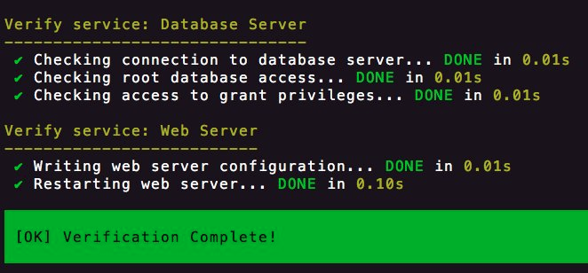

# Introduction

Provision is a command-line interface for quickly launching websites on any computer for development, testing, or production.

Provision is awesome because it's designed to work with any system and because it's written in PHP making it familiar to web developers.

Provision is stable because it comes from a long history of automating Drupal hosting within the [Aegir Project](https://www.aegirproject.org/).

The 4.x version is a total rewrite, based on [Symfony Console](https://symfony.com/doc/3.4/console.html) and [Robo](https://robo.li/) components. We are working to make Provision a useful stand-alone command for managing any kind of web app.

## How it Works

Provision works by abstracting the services needed by your web sites and by knowing how to configure the underlying services automatically. Once setup, you can add new sites simply by telling it a URL and the path to your source code.

For example, Provision knows that Drupal requires two services: a database server and a web server. Provision knows how to configure Apache, NGINX and Docker. It knows how to create a database and configure the permissions. It knows how to set file permissions.

You add your site's URLs and path to your source code using `provision save`and run `provision verify`, and Provision does everything else for you to get a running website.

## Development

Provision 4.x is a work in progress. If you want open source Drupal hosting now, please see [the Aegir Project](https://www.aegirproject.org/).

Currently being developed on GitHub: [github.com/provision4/provision](https://github.com/provision4/provision).

Documentation is still in progress, currently available at [aegir.gitbooks.io/provision](https://aegir.gitbooks.io/provision/).

## Origins

Provision, prior to the 4.x branch, was the "back-end" command line interface for the Aegir Hosting Project, implemented as a set of Drush commands. It was designed simply as a way to let the "front-end" website to run commands to automatically configure the web server.

Read more about Aegir at [www.aegirproject.org](https://www.aegirproject.org) and the original Provision at [www.drupal.org/project/provision.](https://www.drupal.org/project/provision)

## Mission

If this project is to succeed we must make it our mission for Provision to be:

* Easy to use.
* Easy to develop.
* Works Everywhere.

## Goals

* Quickly launch Drupal and other websites from source code.
* Be _Service_ Agnostic and pluggable. Support any web server \(Apache, Nginx, Docker, Kubernetes, `php -s`\), any database server \(MySQL, MariaDB, SQLite\). Allow contributed services.
* Run Anywhere. PHP-CLI works on Mac, Linux, Local, Metal, or Cloud. \(Windows support should be possible, especially since you can now run ubuntu bash\).

## Target Users

Provision is being designed for _everybody involved in building and hosting websites_:

* Site builders and HTML/CSS designers who just want Drupal running locally.
* Web Developers who want to launch copies of websites quickly locally and in CI for testing.
* Systems Admins who want to just get Drupal running \(and updated\) without a lot of hassle.
* Platform Builders who are running Drupal as a Service and need to safely scale the number of sites they are responsible for.

Please join the conversation and submit an issue with your perspective on how we can improve how Provision works for your use case.

## Architecture

Provision 4.x is written in PHP, leveraging [Composer](https://getcomposer.org/) and [Symfony](https://symfony.com/components) components. Provision also leverages [Robo](http://robo.li/) as a framework.

## Documentation

More documentation on the new Provision is coming soon. Thanks for your patience!

--Jon

